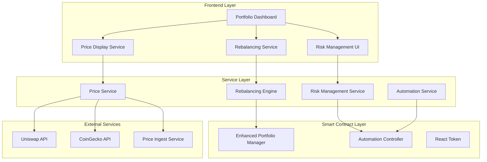

# Enhanced Portfolio Management System Design

## Overview

The Enhanced Portfolio Management System builds upon the existing Reactive Network DeFi platform to provide sophisticated portfolio management capabilities with improved price accuracy, intelligent rebalancing, and advanced risk management. The system maintains backward compatibility with existing contracts while introducing new components for enhanced functionality.

## Architecture

### High-Level Architecture



### Component Interaction Flow

1. **Price Data Flow**: External APIs → Price Service → Price Display Service → UI
2. **Rebalancing Flow**: UI → Rebalancing Engine → Enhanced Portfolio Manager → Blockchain
3. **Risk Management Flow**: Risk Management Service → Automation Controller → Enhanced Portfolio Manager
4. **Manual Trading Flow**: UI → Enhanced Portfolio Manager → Uniswap Router

## Components and Interfaces

### 1. Enhanced Price Display Service

**Purpose**: Provides accurate, real-time price data with multiple fallback sources and proper error handling.

**Key Features**:
- Multi-source price aggregation (Uniswap, CoinGecko, Price Ingest)
- Intelligent caching with TTL management
- Price validation and anomaly detection
- Graceful degradation on API failures

**Interface**:
```javascript
class EnhancedPriceDisplayService {
  async getTokenPrice(tokenAddress, forceRefresh = false)
  async getTokenPrices(tokenAddresses)
  async calculatePercentageChange(tokenAddress, timeframe)
  async validatePriceData(price, tokenAddress)
  subscribeToUpdates(callback)
}
```

### 2. Intelligent Rebalancing Engine

**Purpose**: Executes portfolio rebalancing with consideration for gas costs, market conditions, and trade optimization.

**Key Features**:
- Drift threshold monitoring
- Gas cost analysis and optimization
- Trade batching and sequencing
- Slippage protection

**Interface**:
```javascript
class RebalancingEngine {
  async calculateRebalancingTrades(currentAllocation, targetAllocation)
  async estimateGasCosts(trades)
  async executeRebalancing(trades, maxGasPercent = 2)
  async validateRebalancingConditions()
  getDriftAnalysis(currentAllocation, targetAllocation)
}
```

### 3. Advanced Risk Management Service

**Purpose**: Implements sophisticated risk management strategies including trailing stops and dynamic risk adjustment.

**Key Features**:
- Trailing stop-loss implementation
- Multi-condition risk triggers
- Partial position liquidation
- Emergency panic mode execution

**Interface**:
```javascript
class RiskManagementService {
  async setTrailingStopLoss(tokenAddress, trailPercent, stopPercent)
  async updateRiskParameters(parameters)
  async evaluateRiskTriggers(userAddress, tokenAddress)
  async executePanicMode(userAddress)
  async calculateOptimalSellPortion(riskLevel, position)
}
```

### 4. Enhanced Portfolio Manager Contract

**Purpose**: Extended smart contract functionality for advanced portfolio management features.

**New Functions**:
```solidity
contract EnhancedPortfolioManager {
    // Advanced rebalancing
    function executeOptimizedRebalancing(
        address[] calldata sellTokens,
        address[] calldata buyTokens,
        uint256[] calldata amounts,
        uint256 maxGasPercent
    ) external;
    
    // Trailing stop-loss
    function setTrailingStopLoss(
        address token,
        uint256 trailPercent,
        uint256 stopPercent
    ) external;
    
    // Batch operations
    function batchUpdateAllocations(
        address[] calldata tokens,
        uint256[] calldata allocations
    ) external;
    
    // Gas optimization
    function estimateRebalancingGas(
        RebalancingPlan calldata plan
    ) external view returns (uint256);
}
```

## Data Models

### 1. Enhanced Portfolio State

```javascript
interface PortfolioState {
  userAddress: string;
  totalValue: BigNumber;
  allocations: {
    [tokenAddress: string]: {
      targetPercent: number;
      currentPercent: number;
      currentValue: BigNumber;
      drift: number;
      lastRebalance: Date;
    }
  };
  riskParameters: RiskParameters;
  rebalancingSettings: RebalancingSettings;
}
```

### 2. Risk Parameters

```javascript
interface RiskParameters {
  stopLossPercent: number;
  takeProfitPercent: number;
  trailingStopPercent?: number;
  maxPositionSize: number;
  panicModeActive: boolean;
  riskLevel: 'conservative' | 'moderate' | 'aggressive';
  cooldownPeriod: number;
}
```

### 3. Rebalancing Configuration

```javascript
interface RebalancingSettings {
  driftThreshold: number; // Percentage drift that triggers rebalancing
  maxGasPercent: number; // Maximum gas cost as % of trade value
  minTradeValue: BigNumber; // Minimum trade size to execute
  rebalanceFrequency: 'manual' | 'automatic' | 'scheduled';
  scheduledTime?: Date; // For scheduled rebalancing
}
```

### 4. Price Data Model

```javascript
interface PriceData {
  tokenAddress: string;
  price: BigNumber;
  source: 'uniswap' | 'coingecko' | 'cache';
  timestamp: Date;
  confidence: number; // 0-100 confidence score
  change24h: number;
  volume24h: BigNumber;
  isStale: boolean;
}
```

## Error Handling

### 1. Price Data Errors

- **Stale Data**: Display last known price with timestamp warning
- **API Failures**: Automatic fallback to secondary sources
- **Price Anomalies**: Flag suspicious price movements for user review
- **Network Issues**: Use cached data with degraded functionality warnings

### 2. Rebalancing Errors

- **High Gas Costs**: Defer rebalancing with user notification
- **Insufficient Liquidity**: Partial execution with remaining balance notification
- **Slippage Exceeded**: Transaction revert with suggested parameter adjustment
- **Concurrent Modifications**: Lock mechanism with retry logic

### 3. Risk Management Errors

- **Trigger Failures**: Log error and retry with exponential backoff
- **Partial Execution**: Complete remaining actions in subsequent transactions
- **Oracle Failures**: Use backup price sources for risk calculations
- **Contract Errors**: Graceful degradation to manual mode

## Testing Strategy

### 1. Unit Testing

**Price Display Service**:
- Test price aggregation from multiple sources
- Validate percentage calculations accuracy
- Test caching behavior and TTL expiration
- Mock API failures and test fallback logic

**Rebalancing Engine**:
- Test trade optimization algorithms
- Validate gas cost calculations
- Test drift threshold detection
- Mock various market conditions

**Risk Management Service**:
- Test trailing stop-loss calculations
- Validate risk trigger conditions
- Test panic mode execution
- Mock price volatility scenarios

### 2. Integration Testing

**End-to-End Portfolio Management**:
- Test complete rebalancing workflow
- Validate price updates propagate correctly
- Test manual override scenarios
- Verify automation integration

**Smart Contract Integration**:
- Test contract interaction reliability
- Validate transaction parameter encoding
- Test error handling and recovery
- Verify gas estimation accuracy

### 3. Performance Testing

**Price Service Performance**:
- Load test with multiple concurrent users
- Test API rate limit handling
- Validate cache performance under load
- Test price update frequency limits

**Rebalancing Performance**:
- Test large portfolio rebalancing
- Validate gas optimization effectiveness
- Test concurrent rebalancing requests
- Measure transaction confirmation times

### 4. Security Testing

**Input Validation**:
- Test malformed price data handling
- Validate allocation percentage bounds
- Test unauthorized access attempts
- Verify signature validation

**Smart Contract Security**:
- Test reentrancy protection
- Validate access control mechanisms
- Test overflow/underflow protection
- Verify slippage protection effectiveness

## Implementation Phases

### Phase 1: Core Infrastructure (Requirements 1, 6)
- Enhanced Price Display Service implementation
- Multi-source price aggregation
- Improved percentage calculations
- Price validation and caching

### Phase 2: Intelligent Rebalancing (Requirements 2, 4)
- Rebalancing Engine development
- Gas cost optimization
- Drift threshold monitoring
- Auto-distribute functionality

### Phase 3: Advanced Risk Management (Requirements 3, 5)
- Trailing stop-loss implementation
- Enhanced automation integration
- Panic mode improvements
- Manual override capabilities

### Phase 4: Integration and Optimization
- End-to-end testing
- Performance optimization
- Security audit
- User interface refinements